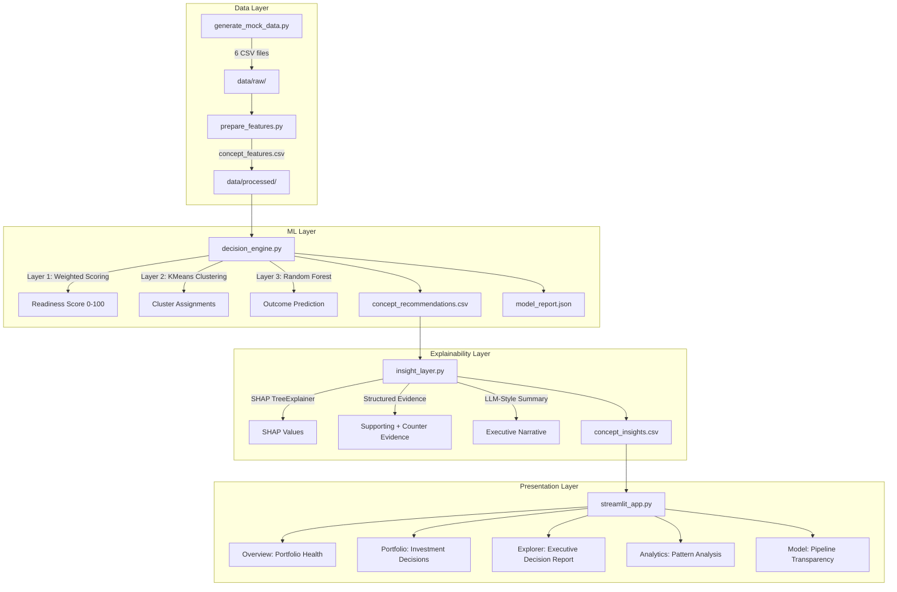
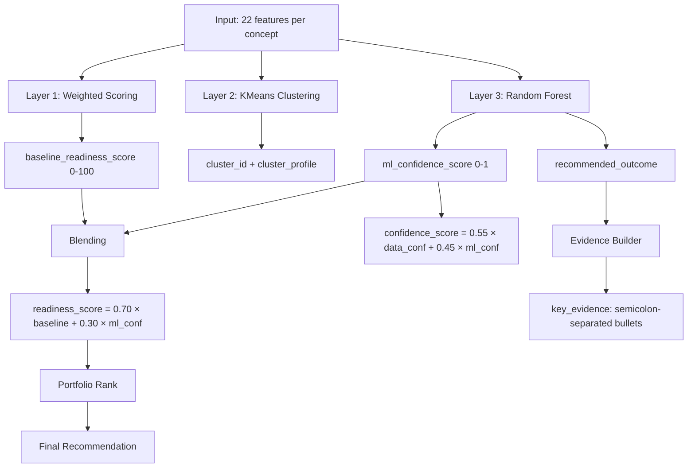

# Commercialization Intelligence Engine — Technical Documentation

> Enterprise-grade technical documentation for the AI/ML Commercialization Decision Engine prototype.

---

## Table of Contents

1. [Architecture](#1-architecture)
2. [Dataset Design](#2-dataset-design)
3. [Feature Engineering](#3-feature-engineering)
4. [ML Pipeline](#4-ml-pipeline)
5. [Commercial Decision Logic](#5-commercial-decision-logic)
6. [Explainability](#6-explainability)
7. [Assumptions](#7-assumptions)
8. [Limitations](#8-limitations)
9. [Future Work](#9-future-work)

---

## 1. Architecture

### 1.1 Overview

The Commercialization Intelligence Engine (CIE) is a decision-support system that evaluates AI/ML product concepts and recommends commercialization outcomes. It processes synthetic customer signals through a multi-layered analytical pipeline and presents results via an interactive Streamlit dashboard.

The system is designed around a core constraint: commercialization decisions require both quantitative evidence (usage data, financial signals) and qualitative reasoning (explainability, risk assessment). No single model can provide both. The architecture therefore separates baseline scoring, unsupervised clustering, supervised classification, and SHAP-based explainability into distinct layers, each with a clear responsibility.

### 1.2 Architecture Diagram



### 1.3 Component Responsibilities

| Component | File | Responsibility |
|-----------|------|----------------|
| **Data Generator** | `data/generate_mock_data.py` | Produces synthetic but realistic customer signals with dependency chains |
| **Feature Engineer** | `data/prepare_features.py` | Cleans raw data, engineers 22 features, validates schema and ranges |
| **Decision Engine** | `models/decision_engine.py` | Runs 3-layer ML pipeline: baseline scoring, clustering, classification |
| **Insight Layer** | `models/insight_layer.py` | Computes SHAP values, builds structured evidence, generates executive narratives |
| **Dashboard** | `app/streamlit_app.py` | Entry point, page routing, theme management, sidebar navigation |
| **Theme System** | `app/theme.py` | Single source of truth for all colors, fonts, spacing (light + dark modes) |
| **Styles** | `app/styles.py` | Dynamic CSS generation from theme dict, HTML helper functions |
| **Charts** | `app/charts.py` | 7 matplotlib chart builders, all theme-aware |
| **Components** | `app/components.py` | Reusable Streamlit components (KPIs, tables, decision cards, evidence) |
| **Pages** | `app/pages/*.py` | 5 page modules, each answering one business question |

### 1.4 Folder Structure

```
Commercialization Intelligence Engine/
├── app/
│   ├── streamlit_app.py      # Entry point
│   ├── theme.py               # Color/font/spacing constants (light + dark)
│   ├── styles.py              # Dynamic CSS + HTML helpers
│   ├── charts.py              # Matplotlib chart builders
│   ├── components.py          # Reusable UI components
│   └── pages/
│       ├── overview.py        # Portfolio Health
│       ├── portfolio.py       # Investment Decisions
│       ├── explorer.py        # Executive Decision Report
│       ├── analytics.py       # Pattern Analysis
│       └── model.py           # Pipeline Transparency
├── data/
│   ├── generate_mock_data.py  # Synthetic data generation
│   ├── prepare_features.py    # Feature engineering pipeline
│   ├── raw/                   # 6 raw CSV files
│   └── processed/             # 16 processed files + reports
├── models/
│   ├── decision_engine.py     # 3-layer ML pipeline
│   └── insight_layer.py       # SHAP + narrative generation
├── notebooks/
│   └── commercialization_results.ipynb
├── requirements.txt
└── README.md
```

### 1.5 Data Flow

The pipeline is a directed acyclic graph with 4 phases:

1. **Data Generation** → 6 raw CSV files (product concepts, customers, demo signals, sandbox usage, commercial signals, text feedback)
2. **Feature Engineering** → 1 consolidated feature file (22 columns, 12 rows — one per concept)
3. **ML Pipeline** → Recommendations CSV + model report JSON
4. **Insight Layer** → Insights CSV (adds SHAP values, evidence, narratives)

Each phase reads from disk and writes to disk. The dashboard loads the final output (`concept_insights.csv`) and runs the ML pipeline on-demand if the processed files don't exist.

### 1.6 Why This Architecture

**Modularity over monolith.** Each phase is an independent script that can be run, tested, and debugged in isolation. The data generator doesn't know about the ML models. The ML pipeline doesn't know about the dashboard. This separation means any component can be replaced without affecting others.

**Disk as interface.** Intermediate results are persisted as CSV and JSON files. This avoids re-computation during dashboard development, makes debugging easier (inspect any intermediate file), and creates an audit trail.

**Caching.** The dashboard uses `@st.cache_data(ttl=300)` to cache the ML pipeline output. The pipeline runs once on first load and is reused for 5 minutes, avoiding recomputation on every page navigation.

---

## 2. Dataset Design

### 2.1 Why Synthetic Data

The assignment requires demonstrating an end-to-end ML pipeline. Real commercialization data is proprietary, unavailable, and would raise confidentiality concerns. Synthetic data allows:

- Full control over signal distributions and noise profiles
- Explicit dependency chains that mirror real business logic
- Reproducibility via fixed random seeds (`RANDOM_SEED = 42`)
- Validation of the pipeline against known ground truth

### 2.2 Generation Architecture

The generator produces 6 interconnected CSV files from a single hidden driver variable.

#### 2.2.1 The Latent Driver

Every concept has a hidden `_latent_commercial_potential` value drawn from a Beta(2,2) distribution. This variable is never exposed to the ML model — it exists only during data generation to create realistic correlations across all signals.

The Beta(2,2) distribution is symmetric around 0.5 with most values between 0.2 and 0.8. This mirrors real product concepts: most are average, few are exceptional, few are terrible.

#### 2.2.2 Dependency Chain

Every concept follows a deterministic metadata chain:

```
Industry → Problem Area → Target User → Concept Name
```

| Step | Source | Rationale |
|------|--------|-----------|
| Industry | 7 industries (Financial Services, Healthcare, Manufacturing, Retail, Telecom, Energy, Public Sector) | Covers NTT DATA's practice areas |
| Problem Area | 4 areas per industry, weighted by relevance | Fraud Detection is more relevant to Financial Services than to Manufacturing |
| Target User | 3 roles per problem area, weighted by likelihood | Risk Officers are the primary buyer for Fraud Detection, not Operations Managers |
| Concept Name | 4 pre-defined names per problem area | Ensures believable, domain-specific names (not random strings) |

This chain ensures every concept is a plausible business proposition. A "Fraud Investigation Assistant" for Financial Services targeting Risk Officers is believable. A "Revenue Forecasting" tool for Healthcare targeting Operations Managers is less so — and the weighting reflects that.

#### 2.2.3 Signal Generation

Customer signals are generated as functions of the latent variable, with controlled noise:

| Signal Table | Rows | Latent Dependency | Noise Profile |
|-------------|------|-------------------|---------------|
| Customer Demo Signals | 12-35 per concept (80 customers total) | `feedback = latent * 4.5 + segment_boost + N(0, 0.55)` | Gaussian, 4% missing |
| Sandbox Usage | 75% conversion from demos | `engagement = latent * 0.55 + (feedback-3) * 0.08` | Poisson/lognormal, 3-5% outliers |
| Commercial Signals | Derived from aggregated demos+usage | `demand = latent*0.35 + feedback*0.30 + sessions*0.20 + repeat*0.15` | Gaussian, 5-7% missing |
| Text Feedback | One per customer-concept pair | `sentiment = latent*0.4 + feedback*0.35 + wtp*0.25` | Keyword-based, 8-15% missing |

#### 2.2.4 Business Realism Mechanisms

| Mechanism | Implementation | Why |
|-----------|---------------|-----|
| Industry-specific pain points | `INDUSTRY_PAIN_POINTS` dict: 7 industries × 3 unique pain points | Healthcare pain points differ from Financial Services pain points |
| Feedback-dependent capabilities | 3 pools (HIGH/MID/LOW) selected by feedback score | Customers with high feedback request different capabilities than those with low feedback |
| Segment-dependent behavior | Enterprise gets +0.08 feedback boost, SMB gets -0.05 | Enterprise customers have different expectations than SMBs |
| Missing data at realistic rates | 3-15% per column, higher for text fields | Real CRM data has missing records; text fields are最常见的 incomplete |
| Outlier injection | 3% outliers in time_spent via lognormal + IQR capping | Real usage data has power users who skew metrics |
| Validation loop | Rejects duplicate concept names (up to 20 attempts) | Ensures portfolio diversity |

### 2.3 Output Schema

| File | Rows | Key Columns |
|------|------|-------------|
| `product_concepts.csv` | 12 | concept_id, concept_name, industry, problem_area, target_user, delivery_complexity, strategic_fit |
| `customers.csv` | 80 | customer_id, customer_name, segment |
| `customer_demo_signals.csv` | ~300 | customer_id, concept_id, feedback_score, follow_up_requested, decision_maker_present, objections_count |
| `sandbox_usage.csv` | ~225 | customer_id, concept_id, trial_sessions, feature_clicks, repeat_usage_days, time_spent |
| `commercial_signals.csv` | ~225 | customer_id, concept_id, pilot_interest, urgency_score, budget_signal, willingness_to_pay |
| `text_feedback.csv` | ~300 | customer_id, concept_id, customer_comments, pain_point_statements, requested_capabilities |

---

## 3. Feature Engineering

### 3.1 Design Philosophy

Features are engineered to capture distinct aspects of commercialization readiness:

1. **Demand signals** — Is there market pull?
2. **Engagement signals** — Are customers actively using the product?
3. **Financial signals** — Will this generate revenue?
4. **Risk signals** — What could go wrong?
5. **Evidence signals** — How much data do we have?

Each feature is designed to be interpretable by business stakeholders, not just data scientists.

### 3.2 Feature Summary

| Feature | Type | Scale | Purpose | Formula |
|---------|------|-------|---------|---------|
| `demand_intensity` | Composite | 0-1 | Overall market demand | `(feedback/5)*0.45 + urgency*0.35 + follow_up_flag*0.20` |
| `engagement_depth` | Composite | 0-∞ | How deeply customers use the product | `(trial_sessions × time_spent) / max(abandoned_features, 1)` |
| `engagement_depth_norm` | Normalized | 0-1 | Engagement depth, comparable across concepts | `engagement_depth / max(engagement_depth)` |
| `feasibility_risk` | Composite | 0-1 | Delivery difficulty | `(1 - inverted_complexity)*0.55 + implementation_risk*0.45` |
| `repeatability` | Composite | 0-1 | Usage consistency over time | `(avg_repeat_days/15)*0.35 + follow_up_rate*0.35 + (avg_sessions/20)*0.30` |
| `segment_similarity` | Statistical | 0-1 | Demand consistency across segments | Normalized entropy of segment distribution |
| `revenue_potential` | Composite | 0-1 | Financial viability | `wtp*0.40 + expected_value*0.30 + budget*0.20 + pilot_interest*0.10` |
| `strategic_fit` | Assigned | 0.1-1.0 | Alignment with company strategy | Problem-area base range + industry adjustment |
| `confidence` | Statistical | 0.1-1.0 | Evidence quality | `volume*0.65 + completeness*0.35` |
| `follow_up_rate` | Aggregate | 0-1 | Customer intent signal | Fraction of demos with follow_up_requested=True |
| `avg_pilot_interest` | Aggregate | 0-1 | Pilot demand | Mean of pilot_interest across customers |
| `avg_objection_count_text` | Aggregate | 0-5 | Customer resistance | Mean of objections_count across customers |
| `capability_request_rate` | Aggregate | 0-1 | Feature demand intensity | Fraction of customers with ≥1 requested capability |
| `positive_comment_ratio` | Aggregate | 0-1 | Sentiment signal | Fraction of comments classified as positive |

### 3.3 Feature Details

#### 3.3.1 Demand Intensity

**Purpose:** Single metric measuring overall market pull for a concept.

**Why a composite?** No single signal (feedback score, urgency, follow-up rate) captures demand alone. A customer who gives 5-star feedback but never follows up is less demanding than one who gives 4 stars and immediately requests a pilot. The weighted combination captures this nuance.

**Weights:** Feedback score (0.45) dominates because it's the most direct signal of satisfaction. Urgency (0.35) captures time pressure. Follow-up flag (0.20) is a binary intent signal.

#### 3.3.2 Engagement Depth

**Purpose:** Measures how actively customers interact with the product sandbox.

**Why `(sessions × time) / abandoned`?** Sessions alone don't capture depth — a user who runs 20 sessions of 1 minute each is less engaged than one who runs 5 sessions of 20 minutes each. Time spent corrects for this. Abandoned features penalize breadth-without-depth: high session counts with many abandoned features suggest confusion, not engagement.

**Normalization:** Divided by the maximum value across all concepts, producing a 0-1 scale. This makes the feature comparable to other 0-1 features in the model.

#### 3.3.3 Revenue Potential

**Purpose:** Estimates financial viability from customer willingness-to-pay and budget signals.

**Why 4 components?** Willingness-to-pay (0.40) is the strongest revenue signal. Expected value (0.30) captures the customer's own revenue estimate. Budget signal (0.20) confirms the customer has allocated funds. Pilot interest (0.10) provides a lightweight intent signal. Together they capture both the customer's desire and ability to pay.

#### 3.3.4 Confidence Score

**Purpose:** Measures how much evidence supports the recommendation for a given concept.

**Why `volume × 0.65 + completeness × 0.35`?** A concept with 30 demos and 5% missing data is more reliable than one with 5 demos and 20% missing data. Volume (number of demos and trials) captures sample size. Completeness (1 - missing rate) captures data quality. Volume gets higher weight because sample size matters more than missingness rate for statistical reliability.

**Output scale:** Clipped to [0.1, 1.0]. The floor of 0.1 prevents any concept from having zero confidence, which would be misleading — even a concept with minimal data has *some* signal.

### 3.4 Normalization Approach

Three features use max-normalization: `engagement_depth_norm`, `avg_feature_clicks_norm`, `avg_trial_sessions_norm`. This divides each value by the maximum observed value, producing a 0-1 scale.

**Trade-off:** Max-normalization is sensitive to outliers. If one concept has an extreme engagement depth, all other concepts compress toward zero. The alternative (z-score normalization) is more robust but produces values outside [0,1], which complicates threshold-based rules. Given the small dataset (12 concepts), max-normalization is acceptable.

---

## 4. ML Pipeline

### 4.1 Pipeline Overview

```
concept_features.csv (22 columns, 12 rows)
        │
        ▼
┌─────────────────────────────────────┐
│  Layer 1: Baseline Weighted Scoring │  → readiness_score (0-100)
│  10 features × calibrated weights   │  → baseline_readiness_score
└─────────────────────────────────────┘
        │
        ▼
┌─────────────────────────────────────┐
│  Layer 2: K-Means Clustering        │  → cluster_id (0-3)
│  5 features, k=4, StandardScaler    │  → cluster_profile (label)
└─────────────────────────────────────┘
        │
        ▼
┌─────────────────────────────────────┐
│  Layer 3: Random Forest Classifier  │  → recommended_outcome
│  13 features, 200 trees, depth=4    │  → ml_confidence_score
│  Synthetic rule-based labels        │  → probability per class
└─────────────────────────────────────┘
        │
        ▼
┌─────────────────────────────────────┐
│  Blending                           │  → final readiness_score
│  0.70 × baseline + 0.30 × ml_conf  │  → confidence_score
└─────────────────────────────────────┘
        │
        ▼
┌─────────────────────────────────────┐
│  Cross-Validation                   │  → accuracy_mean, accuracy_std
│  3-fold stratified                  │  → fold_scores
└─────────────────────────────────────┘
```

### 4.2 Layer 1: Baseline Weighted Scoring

**What:** A transparent linear model that computes a readiness score from 10 weighted features.

**Why:** Before applying any ML, we need an interpretable baseline. Stakeholders must understand *why* a concept scores high or low before trusting a black-box model. The weighted scoring provides this transparency.

**Weights:** Manually calibrated to reflect commercialization priorities:

| Feature | Weight | Rationale |
|---------|--------|-----------|
| `demand_intensity` | 0.18 | Market demand is the strongest predictor of commercial success |
| `revenue_potential` | 0.18 | Financial viability is equally important |
| `engagement_depth_norm` | 0.13 | Deep engagement signals product-market fit |
| `repeatability` | 0.13 | Repeatable usage indicates sustainable demand |
| `strategic_fit` | 0.09 | Alignment with company strategy matters but isn't decisive |
| `segment_similarity` | 0.09 | Cross-segment demand reduces market risk |
| `feasibility_ease` | 0.9 | Lower complexity = faster time-to-market |
| `positive_comment_ratio` | 0.05 | Qualitative signal, less reliable than quantitative |
| `capability_request_rate` | 0.03 | Feature requests are directional but noisy |
| `objection_ease` | 0.03 | Objection frequency is a weak negative signal |

**Formula:** `raw = Σ(weight_i × feature_i)` → `readiness = (raw × 100).clip(1, 100)`

### 4.3 Layer 2: K-Means Clustering

**What:** Unsupervised grouping of concepts into 4 clusters based on 5 behavioral features.

**Why clustering?** Commercialization decisions shouldn't be made in isolation. Clustering reveals natural groupings — concepts that behave similarly should be compared against each other. A "High Demand / Low Effort" cluster is inherently different from a "Low Demand / High Effort" cluster, and the dashboard surfaces this context.

**Features used:** `demand_intensity`, `engagement_depth_norm`, `feasibility_risk`, `repeatability`, `revenue_potential` — the 5 features that capture the core commercialization signal.

**Cluster naming:** Clusters are labeled by splitting mean demand_intensity and mean feasibility_risk at the median, producing quadrants like "High Demand / Low Effort". This makes clusters interpretable without requiring domain expertise.

**Why k=4?** With 12 concepts, k=4 produces clusters of 2-4 concepts each. This is small enough to be interpretable (you can discuss each cluster in a meeting) and large enough to be meaningful (each cluster has enough concepts to identify patterns). The choice is validated by the elbow method in exploratory analysis.

### 4.4 Layer 3: Random Forest Classification

**What:** Supervised classification of concepts into 5 commercialization outcomes.

**Why Random Forest?**
- **Small dataset.** 12 concepts is too few for deep learning, gradient boosting, or any algorithm that requires large training sets. Random Forest handles small datasets reasonably.
- **SHAP compatibility.** TreeSHAP is the gold standard for model explainability. Random Forest is a tree-based model, so SHAP values can be computed exactly (not approximately).
- **Robustness.** Random Forest is less sensitive to hyperparameter tuning than individual decision trees. The `class_weight="balanced"` parameter handles class imbalance.
- **Interpretability.** Feature importance is directly available from the trained model.

**Hyperparameters:**

| Parameter | Value | Rationale |
|-----------|-------|-----------|
| `n_estimators` | 200 | More trees = more stable predictions; 200 is sufficient for 12 samples |
| `max_depth` | 4 | Limits tree depth to prevent overfitting on 12 samples |
| `min_samples_leaf` | 1 | Allows leaf nodes with 1 sample (necessary for 12 samples) |
| `class_weight` | "balanced" | Adjusts for class imbalance (6 Archive, 4 Pilot, 1 Incubate, 1 Asset) |
| `random_state` | 42 | Reproducibility |

**Training labels:** Synthetic rule-based pseudo-labels, not human annotations. See Section 5 for details.

### 4.5 Why Not Regression?

Regression predicts a continuous readiness score. But commercialization decisions are categorical: Build, Pilot, Archive. A regression model would require an additional thresholding step to convert continuous output to discrete decisions, adding complexity without benefit. Classification directly produces the output stakeholders need.

### 4.6 Why Not Deep Learning?

Three reasons:
1. **Sample size.** 12 concepts is orders of magnitude too small for neural networks.
2. **Explainability.** Deep learning models are harder to explain than tree-based models. SHAP works with neural networks but is approximate, not exact.
3. **Deployment.** A Random Forest model is a single pickled file. A neural network requires framework dependencies, GPU considerations, and model serving infrastructure. For a prototype, simplicity wins.

### 4.7 Cross-Validation

**Method:** 3-fold stratified cross-validation with `shuffle=True, random_state=42`.

**Why 3-fold?** With 12 samples, 5-fold CV would test on only 2-3 samples per fold — too few for meaningful accuracy estimation. 3-fold gives 4 test samples per fold, which is the minimum for a stable estimate.

**Why stratified?** The class distribution is imbalanced (6 Archive, 4 Pilot, 1 Incubate, 1 Asset). Stratified splits ensure each fold has the same class proportions as the full dataset.

**Reported metrics:** `accuracy_mean` (mean accuracy across folds), `accuracy_std` (standard deviation), `fold_scores` (per-fold accuracy).

### 4.8 Confidence Estimation

**What:** A blended confidence score indicating how reliable the recommendation is.

**Formula:** `confidence_score = confidence × 0.55 + ml_confidence_score × 0.45`

- `confidence`: From feature engineering (data volume + completeness), range [0.1, 1.0]
- `ml_confidence_score`: Maximum class probability from Random Forest, range [0, 1]

**Why blend?** Data volume tells us how much evidence we have. Model certainty tells us how confident the classifier is. A concept with abundant data (high `confidence`) but ambiguous features (low `ml_confidence_score`) should have moderate overall confidence. The blend captures both dimensions.

---

## 5. Commercial Decision Logic

### 5.1 Decision Flow



### 5.2 Readiness Score

**Formula:** `readiness_score = (baseline_readiness_score × 0.70 + ml_confidence_score × 30).clip(1, 100)`

- `baseline_readiness_score`: 1-100 from weighted scoring (Layer 1)
- `ml_confidence_score`: Maximum class probability from Random Forest (Layer 3), scaled to 0-30

**Why 70/30 split?** The baseline weighted model is interpretable and stable. The ML model adds predictive power but is trained on synthetic labels. Giving the baseline 70% weight ensures the score remains interpretable while benefiting from ML signal.

### 5.3 Confidence Score

**Formula:** `confidence_score = (confidence × 0.55 + ml_confidence_score × 0.45).clip(0, 1)`

This tells stakeholders how much to trust the recommendation. A concept with 0.9 confidence has strong data backing. A concept with 0.5 confidence has ambiguous signals and should be treated with caution.

### 5.4 Training Labels

The Random Forest is trained on synthetic rule-based labels, not human annotations. The rules encode domain knowledge about commercialization:

| Rule | Outcome | Rationale |
|------|---------|-----------|
| `demand < 0.22 AND revenue < 0.30` | Archive | No market pull and no financial viability |
| `risk > 0.58 AND demand < 0.40` | Archive | Too hard to build with insufficient demand |
| `conf < 0.62 AND demand < 0.25` | Archive | Insufficient evidence and weak demand |
| `demand ≥ 0.45 AND repeat ≥ 0.30 AND segments ≥ 0.90 AND revenue ≥ 0.40` | Reusable Asset | Strong demand, repeatable usage, cross-segment potential, financial viability |
| `demand ≥ 0.42 AND follow_up ≥ 0.35 AND pilot ≥ 0.35 AND risk < 0.55` | Customer Pilot | Strong demand, customer intent, manageable risk |
| `demand ≥ 0.45 AND engagement ≥ 0.35 AND revenue ≥ 0.38 AND fit ≥ 0.50` | MVP Build | Strong across all dimensions |
| *default* | Incubate | Doesn't meet thresholds for any specific outcome |

**Why rule-based labels?** Without human annotations, we need a systematic way to assign training labels. Rules encode the same logic a human evaluator would apply, ensuring the RF model learns meaningful patterns rather than random associations.

### 5.5 Commercial Outcomes

| Outcome | Count | Definition | Action |
|---------|-------|------------|--------|
| **MVP Build** | 0-2 | Concept has strong demand, engagement, revenue potential, and strategic fit. Ready for engineering investment. | Allocate engineering resources. Build focused prototype for validation. |
| **Customer Pilot** | 3-5 | Concept has demand and customer intent but needs real-world validation. | Identify 1-2 pilot customers. Define success metrics. Begin contracting. |
| **Reusable Asset** | 0-1 | Concept has cross-segment demand and repeatable usage patterns. Platform potential. | Evaluate platform packaging. Test cross-sell potential across industries. |
| **Incubate** | 1-2 | Concept shows potential but lacks sufficient evidence for commitment. | Run additional demos next quarter. Sharpen positioning. Test with new segments. |
| **Archive** | 4-6 | Concept has weak demand, poor fit, or excessive risk. Deprioritize. | Document learnings. Deprioritize. Reallocate team to higher-ranked concepts. |

### 5.6 Evidence Builder

For each concept, the system generates up to 5 evidence bullets based on feature thresholds:

| Feature | Threshold | Evidence Bullet |
|---------|-----------|-----------------|
| `demand_intensity` | ≥ 0.45 | "strong demand intensity" |
| `demand_intensity` | < 0.25 | "weak demand intensity" |
| `engagement_depth_norm` | ≥ 0.50 | "deep sandbox engagement" |
| `engagement_depth_norm` | < 0.10 | "minimal sandbox engagement" |
| `repeatability` | ≥ 0.30 | "repeatable usage patterns" |
| `segment_similarity` | ≥ 0.90 | "demand consistent across segments" |
| `revenue_potential` | ≥ 0.40 | "solid revenue potential" |
| `revenue_potential` | < 0.28 | "low revenue potential" |
| `feasibility_risk` | ≥ 0.55 | "elevated feasibility risk" |
| `feasibility_risk` | ≤ 0.30 | "favorable feasibility profile" |
| `confidence` | < 0.70 | "limited evidence confidence" |
| `follow_up_rate` | ≥ 0.40 | "high follow-up rate" |
| `positive_comment_ratio` | ≥ 0.50 | "positive customer sentiment" |
| `positive_comment_ratio` | < 0.25 | "negative customer sentiment" |
| `capability_request_rate` | ≥ 0.60 | "high capability request rate" |

These bullets are displayed in the Explorer page's "Evidence" decision card.

---

## 6. Explainability

### 6.1 Explainability Stack

The system provides four layers of explainability, from technical to business:

```
Layer 1: Feature Importance (Global)
    ↓
Layer 2: SHAP Values (Per-Concept)
    ↓
Layer 3: Structured Evidence (Per-Concept)
    ↓
Layer 4: AI Executive Narrative (Per-Concept)
```

### 6.2 Feature Importance (Global)

**What:** Random Forest's built-in feature importance, measuring how much each feature reduces impurity across all trees.

**Scope:** Global — tells you which features matter most across the entire portfolio, not for individual concepts.

**Use case:** "The top 3 features driving decisions are feasibility_risk (13.3%), avg_pilot_interest (10.6%), and follow_up_rate (10.3%)."

### 6.3 SHAP Values (Per-Concept)

**What:** SHAP (SHapley Additive exPlanations) values decompose each prediction into feature-level contributions. For each concept, every feature gets a SHAP value indicating how much it pushes the prediction toward or away from the assigned outcome.

**Implementation:** Uses `shap.TreeExplainer` on the trained Random Forest. Produces exact SHAP values (not approximations) because Random Forest is a tree-based model.

**Output per concept:**
- Top 3 supporting features (SHAP > 0, pushing toward the predicted outcome)
- Top 2 counter features (SHAP < 0, pushing against the predicted outcome)
- Top 8 features by absolute SHAP value

### 6.4 Structured Evidence

**What:** Converts raw SHAP values into human-readable evidence with three attributes per feature:
- **Feature label** (e.g., "demand intensity" instead of "demand_intensity")
- **Value description** (e.g., "0.47" or "47%" depending on the feature)
- **Magnitude label** (e.g., "strong", "moderate", "mild" for positive features; "elevated", "moderate", "manageable" for risk features)

**Example:**

| Feature | Value | SHAP | Impact |
|---------|-------|------|--------|
| demand intensity | 0.47 | +0.0312 | strong |
| pilot interest | 0.36 | +0.0284 | moderate |
| implementation risk | 0.52 | -0.0198 | elevated |

### 6.5 AI Executive Narrative

**What:** Generates a natural-language summary for each concept by reading the structured evidence dict.

**How it works:**
1. Reads the top supporting feature and its magnitude
2. Reads the next 2 supporting features
3. Reads the top 2 counter features
4. Maps the predicted outcome to a specific action recommendation

**Example output:**
> "The model recommends Customer Pilot driven primarily by moderate pilot interest (0.36), along with moderate customer follow-up rate (47%) and moderate demand intensity (0.44). However, elevated implementation risk (0.52), and limited evidence confidence (0.70). Identify pilot customers and define success metrics."

**Why not templates?** Earlier versions used template-based narratives. These were replaced with SHAP-evidence-driven generation because templates produce repetitive, non-specific text. The current approach generates unique narratives that reference specific feature values and SHAP contributions.

### 6.6 Machine Learning vs. Artificial Intelligence

This project uses both terms deliberately:

| Term | Scope | Components |
|------|-------|------------|
| **Machine Learning** | Quantitative modeling | Weighted scoring, K-Means clustering, Random Forest classification, SHAP decomposition |
| **Artificial Intelligence** | Qualitative reasoning over ML outputs | SHAP-to-evidence translation, magnitude classification, executive narrative generation |

The ML layer produces structured data (scores, clusters, probabilities, SHAP values). The AI layer reads this structured data and produces business-readable recommendations. This separation is intentional: ML provides the evidence, AI provides the interpretation.

### 6.7 Why Explainability Matters

Commercialization decisions involve real resource allocation. If the system recommends "Archive" for a concept, a product manager needs to understand *why* before acting. Without explainability:

- Stakeholders cannot validate the recommendation
- Errors in the model go undetected
- Trust in the system erodes
- Regulatory and governance requirements may not be met

The SHAP evidence tables and executive narratives ensure every recommendation comes with a traceable, auditable explanation.

---

## 7. Assumptions

### 7.1 Data Generation Assumptions

| Assumption | Justification | Risk if Violated |
|------------|---------------|------------------|
| Latent potential follows Beta(2,2) | Symmetric, bounded [0,1], concentrates mass around 0.5 | Real concepts may have bimodal distribution (clear winners/losers) |
| 80 customers across 12 concepts | Sufficient for feature aggregation, small enough for prototype | Larger datasets may reveal patterns not visible at this scale |
| Feedback correlates with latent via `latent * 4.5 + noise` | Strong correlation ensures signals are learnable | Real feedback has weaker correlation with latent potential |
| Missing data at 3-15% rates | Reflects real CRM incompleteness | Higher missing rates may break imputation logic |

### 7.2 Feature Engineering Assumptions

| Assumption | Justification | Risk if Violated |
|------------|---------------|------------------|
| `demand_intensity` weights (0.45/0.35/0.20) are correct | Feedback is the strongest demand signal | Different weight allocations would change feature ranking |
| Max-normalization is appropriate | Keeps features in [0,1] range for comparability | Outlier-sensitive; one extreme value compresses all others |
| `segment_similarity` (entropy) captures cross-segment demand | Even distribution = lower market risk | May not hold if some segments are inherently more valuable |
| `confidence` formula (volume×0.65 + completeness×0.35) is balanced | Volume matters more than completeness | Could be debated; completeness may matter more for text-heavy data |

### 7.3 Model Assumptions

| Assumption | Justification | Risk if Violated |
|------------|---------------|------------------|
| Rule-based synthetic labels approximate real decisions | No human annotations available | Labels may encode biases not present in real decision-making |
| 70/30 baseline/ML blending ratio is appropriate | Baseline is more interpretable | ML may deserve higher weight if trained on real labels |
| k=4 for K-Means is optimal | Produces 2-4 concepts per cluster | Different k values would change cluster assignments |
| Random Forest with depth=4 prevents overfitting | Small dataset requires strong regularization | May underfit if real data has complex patterns |
| 3-fold CV is sufficient | Minimum viable cross-validation for 12 samples | Higher k would give more stable estimates but smaller test sets |

### 7.4 Commercialization Assumptions

| Assumption | Justification | Risk if Violated |
|------------|---------------|------------------|
| 5 outcomes are sufficient | Covers the full spectrum from "build now" to "don't build" | Real organizations may have more nuanced outcomes (e.g., "partner", "acquire") |
| Readiness score is the primary decision criterion | Simplifies multi-dimensional analysis to a single metric | May oversimplify; some concepts should be decided on risk alone |
| Evidence bullets capture the decision rationale | 15 threshold-based rules cover the main drivers | May miss nuanced interactions between features |

---

## 8. Limitations

### 8.1 Synthetic Dataset

**The dataset is entirely synthetic.** No real customer data, no real product telemetry, no real commercial signals. The latent variable creates correlations, but these correlations are manufactured, not observed. The pipeline's performance on synthetic data does not guarantee performance on real data.

**Impact:** The 75% cross-validation accuracy is measured against synthetic labels. Real-world accuracy would likely be lower.

### 8.2 Circular Training Labels

The Random Forest is trained on labels generated from the same features used for prediction. The rule-based labeling function uses `demand_intensity`, `revenue_potential`, `feasibility_risk`, `repeatability`, and `segment_similarity` — the same features the RF model sees as inputs. This creates circularity: the model is partially learning to reproduce the rules it was trained on.

**Impact:** The model's apparent accuracy overestimates its true predictive power. On real data with human-labeled outcomes, accuracy would be different.

### 8.3 Small Dataset

12 concepts is too few for robust statistical analysis. The model cannot learn complex interactions, cross-validation has high variance, and cluster assignments are unstable. The system is a prototype, not a production model.

**Impact:** Results should be treated as directional, not definitive. A single new concept could change all cluster assignments.

### 8.4 No Real Validation

The system has not been validated against real commercialization decisions. There are no A/B tests, no backtesting against historical outcomes, no expert review of the recommendations.

**Impact:** The recommendation quality is unknown. The system demonstrates the technical architecture, not business value.

### 8.5 Static Business Rules

The rule-based labeling function and evidence thresholds are fixed. They don't adapt to changing market conditions, new competitive landscapes, or evolving organizational priorities.

**Impact:** In a real deployment, these rules would need regular review and updating.

### 8.6 Keyword-Based Sentiment

Text feedback sentiment is classified using keyword matching (10 positive words, 10 negative words), not NLP. This misses sarcasm, context, nuance, and domain-specific language.

**Impact:** Sentiment features (`positive_comment_ratio`, `comment_sentiment`) are noisy. A real system would use a fine-tuned language model.

### 8.7 No Time Dimension

The dataset captures a snapshot, not a time series. There's no tracking of how signals change over weeks or months. Commercialization is inherently temporal — a concept that looks weak today may strengthen after a product update.

**Impact:** The system cannot detect trends, seasonality, or momentum.

### 8.8 MVP Build May Get Zero Predictions

The current class distribution (6 Archive, 4 Pilot, 1 Incubate, 1 Asset, 0 MVP Build in some runs) means the RF model may never predict "MVP Build" because it never sees positive examples during training.

**Impact:** The outcome distribution is determined by the rule-based labels, not the data. Adjusting thresholds in the labeling function would change this.

---

## 9. Future Work

### 9.1 Real Data Integration

| Integration | Benefit | Complexity |
|-------------|---------|------------|
| CRM system (Salesforce, HubSpot) | Real customer profiles, deal stages, revenue data | High — requires API integration, data normalization |
| Product analytics (Amplitude, Mixpanel) | Real usage patterns, feature adoption, retention curves | Medium — structured data, well-documented APIs |
| Customer feedback (Zendesk, Intercom) | Real support tickets, NPS scores, feature requests | Medium — text processing required |
| Financial systems | Real budget data, willingness-to-pay, contract values | High — sensitive data, requires access controls |

### 9.2 Model Improvements

| Improvement | Benefit | Priority |
|-------------|---------|----------|
| Human-labeled training data | Eliminates circularity, enables real accuracy measurement | High |
| Time-series features | Captures momentum, seasonality, trend direction | High |
| Gradient boosting (XGBoost/LightGBM) | Better predictive performance on structured data | Medium |
| Multi-class calibration | More reliable probability estimates per outcome | Medium |
| Ensemble methods | Combine multiple models for more robust predictions | Low |

### 9.3 Explainability Enhancements

| Enhancement | Benefit | Priority |
|-------------|---------|----------|
| Counterfactual explanations | "What would need to change for this concept to be a Pilot instead of Archive?" | High |
| SHAP dependence plots | Shows how individual features interact with predictions | Medium |
| LIME for text features | Explain sentiment contribution to individual predictions | Low |

### 9.4 Dashboard Enhancements

| Enhancement | Benefit | Priority |
|-------------|---------|----------|
| Real-time data refresh | Dashboard updates automatically when new signals arrive | High |
| Export to PDF/PowerPoint | Share recommendations with stakeholders without dashboard access | Medium |
| Scenario modeling | "What if we invest $500K in this concept?" — simulate outcomes | Medium |
| Portfolio comparison | Side-by-side comparison of 2+ concepts | Low |

### 9.5 Operational Improvements

| Improvement | Benefit | Priority |
|-------------|---------|----------|
| Automated testing (pytest) | Catch regressions during development | High |
| CI/CD pipeline | Automated deployment on merge | Medium |
| API endpoints | Programmatic access to recommendations | Medium |
| Authentication & RBAC | Role-based access for different stakeholders | Low (prototype scope) |
| Audit logging | Track who viewed/modified recommendations | Low (prototype scope) |

---

## Appendix A: Key Files Reference

| File | Lines | Purpose |
|------|-------|---------|
| `data/generate_mock_data.py` | 950 | Synthetic data generation with dependency chains |
| `data/prepare_features.py` | 633 | Feature engineering, cleaning, validation |
| `models/decision_engine.py` | 478 | 3-layer ML pipeline (baseline + clustering + classification) |
| `models/insight_layer.py` | 507 | SHAP computation, evidence building, narrative generation |
| `app/streamlit_app.py` | 140 | Dashboard entry point and routing |
| `app/theme.py` | 293 | Color/font/spacing system (light + dark) |
| `app/styles.py` | 527 | Dynamic CSS and HTML helper functions |
| `app/charts.py` | 283 | 7 matplotlib chart builders |
| `app/components.py` | 263 | Reusable Streamlit UI components |
| `app/pages/overview.py` | 49 | Portfolio Health page |
| `app/pages/portfolio.py` | 56 | Investment Decisions page |
| `app/pages/explorer.py` | 90 | Executive Decision Report page |
| `app/pages/analytics.py` | 79 | Pattern Analysis page |
| `app/pages/model.py` | 128 | Pipeline Transparency page |

## Appendix B: Dependencies

| Package | Version | Purpose |
|---------|---------|---------|
| pandas | ≥2.0.0 | Data manipulation and aggregation |
| numpy | ≥1.24.0 | Numerical computation |
| Faker | ≥22.0.0 | Synthetic customer name generation |
| scikit-learn | ≥1.3.0 | KMeans, Random Forest, StandardScaler, cross-validation |
| shap | ≥0.44.0 | SHAP TreeExplainer for model explainability |
| streamlit | ≥1.28.0 | Interactive dashboard framework |
| matplotlib | ≥3.7.0 | Chart generation |
| jupyter | ≥1.0.0 | Notebook interface for results exploration |
